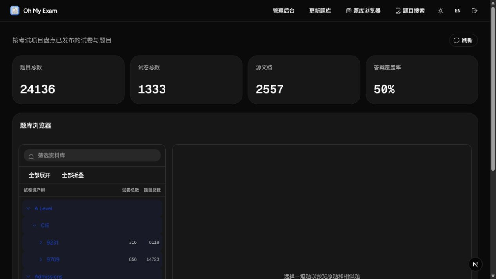
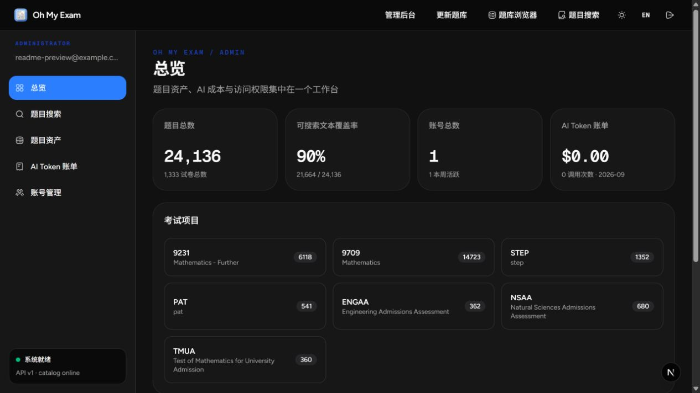
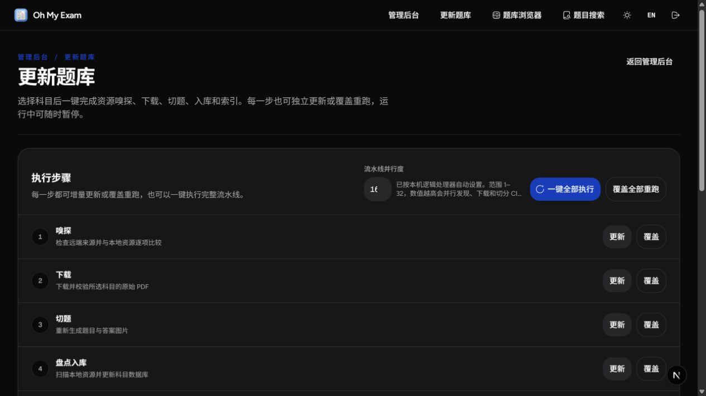
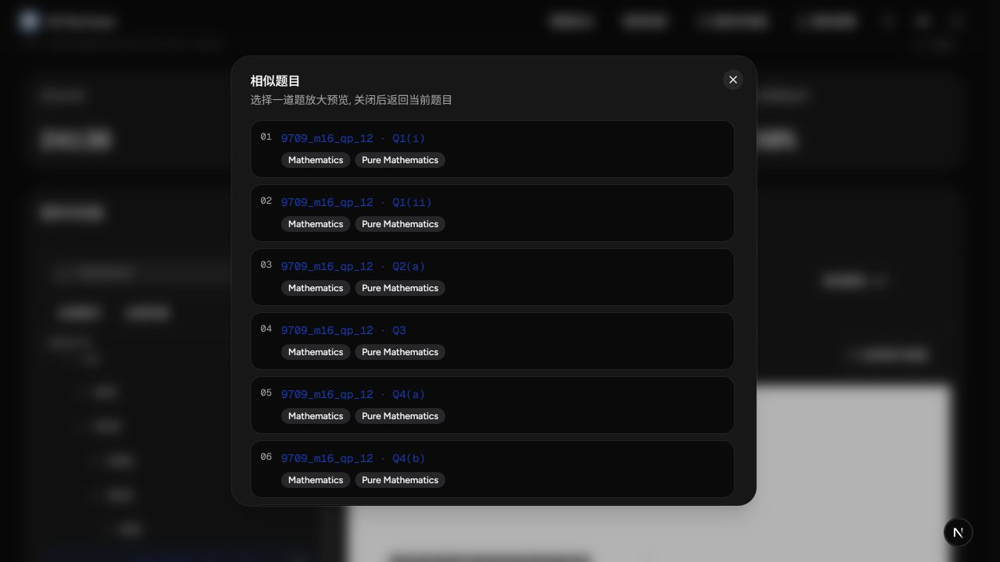

# Oh My Exam

> A reproducible exam-paper intelligence pipeline: discover source papers, download and verify immutable PDFs, split questions with layout geometry and OCR, clean and index the results, then publish a searchable catalog with explainable similar-question recommendations.

[简体中文](README_CN.md) · **English**



---

## More than a question bank

Oh My Exam turns exam papers with inconsistent sources, ages, layouts, and scan quality into a uniform, searchable, auditable data product. It combines:

- a bilingual question browser for students and teachers;
- an administration workspace for catalog updates, asset inspection, accounts, and system monitoring;
- a complete ingestion pipeline that remains independently callable from the CLI;
- source adapters for CIE A Level, STEP, PAT, TMUA, ENGAA, and NSAA;
- an end-to-end path from immutable PDFs to question images, answer images, extracted text, syllabus tags, recommendations, and a published SQLite catalog.

The local catalog shown in the screenshots contains 24,136 questions, 1,333 papers, and 2,557 source documents. Runtime data is not committed to Git; actual counts depend on the locally built catalog.



## The complete pipeline

```text
Source discovery
      ↓
Concurrent download + SHA-256 verification + immutable PDFs
      ↓
PDF object analysis ──→ subject-specific geometry cutters
                 └────→ OCR / raster-layout fallback
      ↓
Question-answer linking + text extraction + normalization
      ↓
Metadata validation + portable subject databases
      ↓
Syllabus tags + sparse TF-IDF vectors + similarity ranking
      ↓
Isolated candidate-catalog validation
      ↓
Atomic publication
```

Every stage can run independently, incrementally, or in overwrite mode. Web requests create durable job records while the real work runs in an isolated subprocess. Jobs remain inspectable after a browser disconnect, support pause/resume, and continuously report stage, current resource, elapsed time, and estimated time remaining.



## Fast downloading without abusing upstream servers

- Fixed-source probes compare remote identities against local immutable PDFs before download confirmation.
- Concurrent discovery and downloads share an adaptive request gate. Sustained success expands the AIMD window; HTTP 429/503 responses halve it and honor `Retry-After`.
- Recommended pipeline parallelism follows the machine's logical processor count and is bounded to 1-32.
- Temporary `.part` files, retries, size checks, and source SHA-256 hashes prevent incomplete files from entering the corpus.
- Incremental mode skips complete artifacts; overwrite mode deterministically rebuilds a selected stage.

## Cutting algorithms: multiple signals, explicit failure

Exam PDFs range from clean vector documents to rotated pages, full-page scans, multi-column mark schemes, and questions spanning several pages. Oh My Exam deliberately combines multiple evidence sources instead of betting the corpus on one regex.

### Subject-specific PDF geometry

Dedicated cutters for CIE 9709 Mathematics and 9231 Further Mathematics inspect PyMuPDF text blocks, words, spans, drawings, embedded images, page boxes, rotation, question labels, subquestion labels, mark columns, and cross-page continuity.

Trusted anchors are detected in PDF coordinates and expanded into multi-page crop regions. Dedicated paths handle rotated pages, full-page images, historical mark-scheme layouts, and missing labels. Post-render ink bounding boxes remove whitespace, while content-coverage audits prevent diagrams, formulas, or question tails from being silently clipped.

### Raster-layout fallback

When a text layer is damaged or unreliable, pages are rendered to higher-resolution grayscale images. Thresholding, row/column projections, and connected regions recover labels and content boundaries. Coordinate transforms preserve the relationship between raster evidence and the original PDF.

### OCR-driven scanned-paper cutting

Historical PAT and STEP scans first use native PDF block and word anchors. If the detected sequence is incomplete, RapidOCR and ONNX Runtime recognize the page, map OCR boxes back into PDF coordinates, merge them with native candidates, and select the longest trusted question-number sequence.

- CUDA is selected automatically when ONNX Runtime exposes `CUDAExecutionProvider`.
- Initialization failure or an incompatible machine falls back to CPU.
- OCR page results are cached to avoid repeated inference during anchor detection, blank-page checks, and answer linking.
- Candidate cuts must pass sequence continuity, declared-question-count, and paired QP/MS count checks. Low-confidence input fails loudly instead of publishing bad crops.

Hardware acceleration is therefore applied where it matters: compute-heavy OCR for scanned papers. Clean vector PDFs take the faster structured-layout path.

## Cleaning, provenance, and reproducibility

Every question sidecar records the source URL, source PDF SHA-256, cutter and version, page indexes, crop regions, rendering parameters, image dimensions, and text-extraction source.

The pipeline also normalizes Unicode, whitespace, line breaks, and question labels; rejects mostly blank pages and meaningless fragments; extracts searchable text from PDF clips with OCR fallback; links question papers to mark schemes using stable identities; stores raw and normalized Markdown answers; validates crop schemas and artifact coverage; and loads large metadata collections concurrently while preserving deterministic output.

The immutable source PDF remains authoritative. Derived artifacts can be reproduced and audited from their manifests.

## Similar questions: explainable sparse vectors, not a black box

The current implementation intentionally avoids pretending that a small, OCR-noisy corpus is a foundation-model search engine. It uses a deterministic hybrid ranker:

1. tokenize normalized question text and remove high-frequency functional words;
2. build L2-normalized sparse TF-IDF vectors;
3. use inverted posting lists to accumulate only candidates that share terms;
4. score with `75% × TF-IDF cosine + 25% × syllabus-topic Jaccard`;
5. exclude questions from the same paper;
6. fill sparse results from shared topics, component, exam program, and finally the global pool.

Topics come from a maintained syllabus hierarchy and a question may carry multiple tags. Ranking uses one global corpus, enabling cross-program recommendations between A Level and admissions questions when their mathematical language and topics overlap. The schema already includes embedding-model and question-embedding tables, so neural retrieval can be introduced later without breaking the current API.



## Search and image search

- Text search covers question text, stable identities, tags, and syllabus knowledge points.
- Selecting a knowledge-tree branch includes all descendant topics.
- Image search accepts camera, file, drag-and-drop, and clipboard input; validates byte and pixel limits; runs RapidOCR with a Tesseract fallback; then ranks all token-matching candidates before returning the top five.
- Previews move between question JPG, answer JPG, structured text, and the source-paper page with recorded regions highlighted.

## Safe catalog publication

Each release is built as an isolated candidate SQLite catalog. The release process runs SQLite `integrity_check` and validates question counts, pre-rendered images, answer coverage, and artifact relationships. Only a passing candidate replaces the active catalog through atomic `os.replace`; a failed build leaves the previous catalog untouched.

Administrator corrections are append-only answer-version rows. A new revision becomes active immediately while older revisions remain available for audit and future rollback.

## Product capabilities

- Responsive Next.js + shadcn client with Chinese/English UI, light/dark themes, and keyboard support;
- FastAPI backend with default-deny API access and HttpOnly browser authentication;
- Argon2 password hashing, account/IP login throttling, and administrator/teacher/student roles;
- lazy-loaded paper trees, cursor pagination, linked question/answer/source previews;
- two-page question-and-answer PDF export;
- administrator CPU, memory, disk, and project-storage monitoring;
- modular-monolith architecture with explicit frontend, API, and pipeline boundaries;
- one core processing layer shared by the Web UI and CLI.

## Quick start

Requirements: Python 3.11+, Node.js 20.17+, and npm. The environment setup installs the PDF and optional OCR dependencies used by the project.

```powershell
python scripts\setup_env.py --group all
Set-Location frontend
npm install
Set-Location ..
python start_server.py --local
```

Open `http://127.0.0.1:4173`. Before the first API start, use `.env.example` to configure the bootstrap administrator and JWT secret.

## Pipeline CLI

The core pipeline does not depend on the Web UI. Install the backend package in editable mode to expose these commands:

```text
ome-cie-alevel-downloader       ome-cie-alevel-splitter
ome-uat-admissions-downloader   ome-uat-admissions-splitter
ome-pat-admissions-downloader   ome-pat-admissions-splitter
ome-step-admissions-downloader  ome-step-admissions-splitter
ome-process-tmua
ome-pack-subject                ome-build-catalog
ome-match-questions
```

Run `COMMAND --help` for adapter-specific options.

TMUA also provides one reproducible end-to-end command:

```powershell
Set-Location backend
..\.venv\Scripts\python scripts\process_tmua.py
```

Use `--skip-download` to rebuild from local immutable PDFs, or `--skip-activate` to stop after creating the portable subject database.

## Verification

```powershell
Set-Location backend
..\.venv\Scripts\python -m pytest -q

Set-Location ..\frontend
npm run lint
npm run typecheck
npm run build
```

Production deployment targets Linux bare metal with systemd and Caddy. Runtime databases, source papers, and generated question assets live under `backend/data/` and are not part of the Git repository. See the [documentation index](docs/index.md) and [architecture](docs/architecture.md) for design details.
